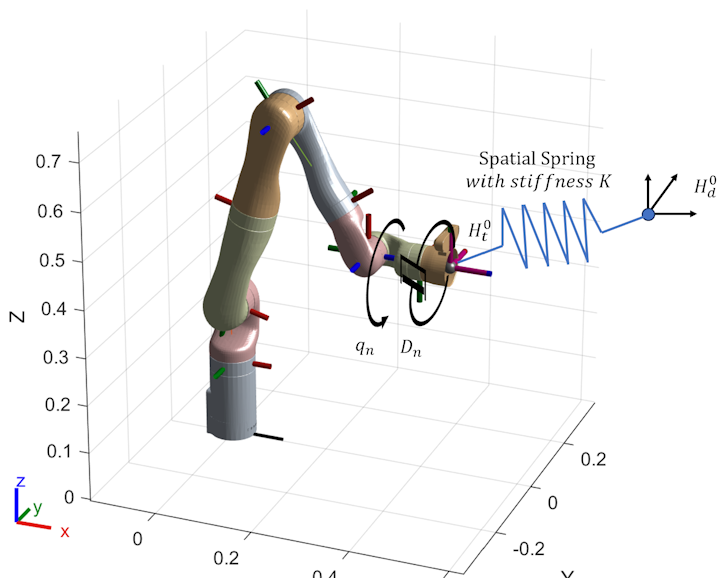
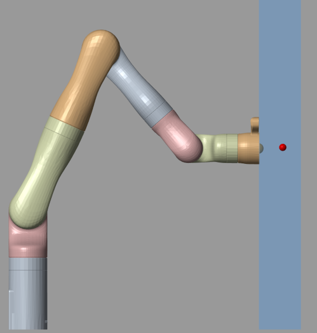
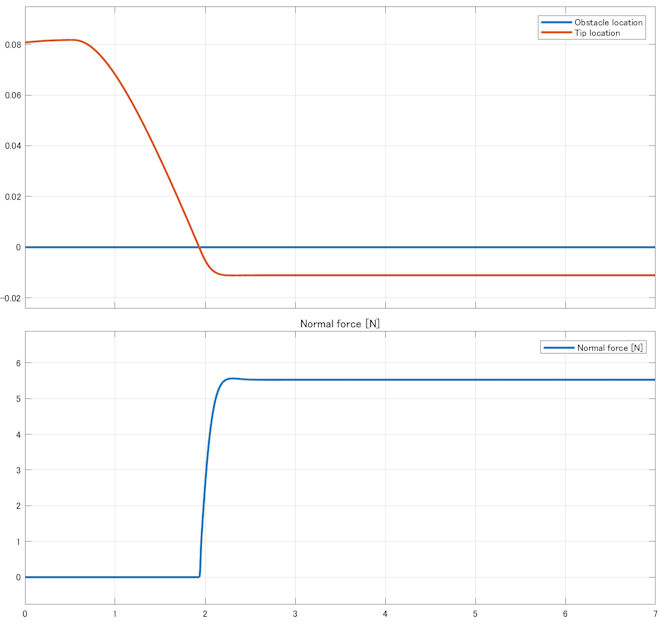
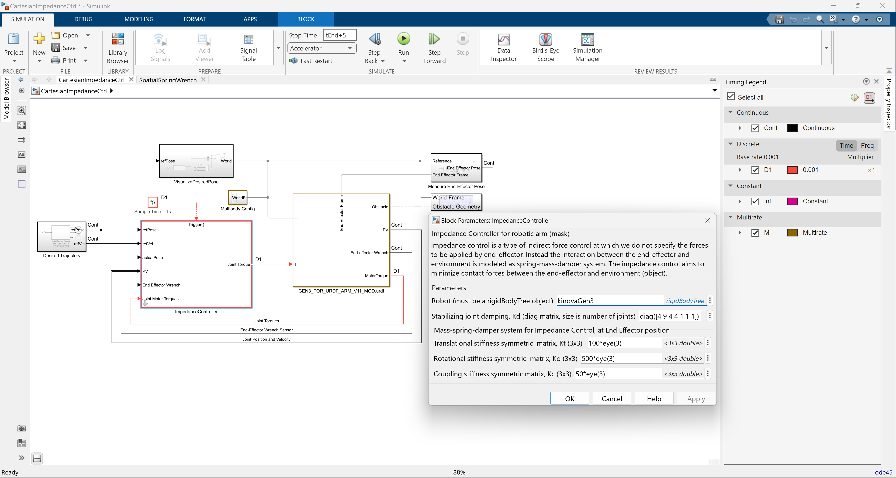

# Impedance Control of a Robotic Manipulator  

ロボットマニピュレータのインピーダンス制御

## Contents

We are entering an era where robots will work alongside humans. This project showcases an impedance control strategy for robotic manipulators that operate in such collaborative scenarios. 
We will briefly introduce the reader to the still-active area of research of robotic impedance control, and then show a simple implementation of an impedance controller that can safely operate a Kinova® Gen3 robotic arm close to a soft viscoelastic material resembling a human body.

## What is Impedance Control for a robotic arm?

* A technique used in robotics to regulate the interaction forces between a robotic arm and its environment. Instead of directly controlling the position or velocity of the robotic arm's end-effector (e.g., gripper), impedance control focuses on controlling the stiffness and damping of the arm's motion, mimicking the behavior of a mechanical spring-damper system.

* It enhances the versatility and adaptability of robotic arms, enabling them to operate effectively in dynamic and uncertain environments while ensuring safe and efficient interaction with objects and humans. In its simplest implementation, used in the present demo, the feedback signals used in the control loop are the end-effector pose, and joint position and velocities, only. No contact force, pressure transducer, or torque sensors are used, making the **method "agnostic" to the environment** where it operates, and thus making it robust to uncertainties.

* The algorithm implementation is straightforward and relatively easy to tune, making it a good alternative compared to traditional control methods (for other control alternatives, refer to the **Appendix** below).

* For an n-DOF robotic manipulator, the cartesian impedance controller is physically described as a multidimensional **virtual spring** that attempts to co-align the robot end-effector pose to a desired pose configuration. In addition to the virtual spring, in order to achieve a satisfactory dynamic behavior and guarantee a robust asymptotic stability, damping is also injected into the system via a joint space damper on each DOF.

* ロボット工学において、ロボットアームとその環境との間の相互作用力を調整するために使用される技術。ロボットアームのエンドエフェクタ（グリッパなど）の位置や速度を直接制御する代わりに、インピーダンス制御は、機械的なバネ・ダンパーシステムの挙動を模倣して、アームの動きの剛性と減衰を制御することに重点を置く。

* ロボットアームの汎用性と適応性を高め、ダイナミックで不確実な環境でも効果的に動作させ、物体や人間との安全で効率的なインタラクションを実現します。今回のデモで使用されている最も単純な実装では、制御ループで使用されるフィードバック信号は、エンドエフェクタの姿勢、関節の位置と速度のみです。接触力、圧力変換器、トルクセンサーを使用しないため、この手法は動作する環境に対して「不可知」であり、不確実性に対してロバストである。

* アルゴリズムの実装は簡単で、チューニングも比較的容易であるため、従来の制御方法（他の制御方法については、以下の付録を参照）に比べて優れた代替方法となる。

* n自由度ロボットマニピュレータの場合、デカルトインピーダンスコントローラは、ロボットのエンドエフェクタの姿勢を所望の姿勢構成に整列させようとする多次元仮想バネとして物理的に記述されます。仮想バネに加えて、満足のいく動的挙動を達成し、ロバストな漸近安定性を保証するために、各自由度の関節空間ダンパを介してシステムに減衰も注入されます。

**Figure 1.** The concept of impedance control, showing the virtual spring and joint damping.

In this demo, we showcase an implementation of a generic impedance controller that works in discrete-time (and thus can be directly used for code generation and deployment to hardware) and can be applied to any robotic arm. In the context of this demo we use a Kinova® Gen3 robot arm model.

Click on below image to watch a video of the robot arm, controlled by an impedance controller.

This shows the manipulator tip following a desired end-effector trajectory shown as a red sphere. Note that the task goal (the red sphere) is intentionally set up well inside the obstacle, to check if the robot arm operates safely when in contact with the external body (the ingress depth is set up by the depthOfIngress parameter, refer to code for details).
The contact force is controlled by the virtual spring at the tip and by the injected joint damping parameters used in the impedance control.

**Figure 2.** Safe operation near obstacle, using impedance control.

Let's display the force at the tip and its position during the maneuver. As seen from the plot, the tip pushes the soft material about 1 cm only and then stops. The normal force remains very small, at less than 6 N (around 0.6 kg force). These values should pose no problem for a human being. If necessary, the controller parameters can be adjusted for an even safer contact. 

**Figure 3.** Limiting the contact force after contact.

Below figure shows the simulation model used in the demo, and highlights the impedance controller block mask where the controller parameters are defined.

**Figure 4.** Simulation model used in the demo.

Artificial joint damping parameters, as well as the translational, rotational, and coupling stiffness parameters, are defined in the controller block mask. They must be properly tuned, based on the application to be performed by the arm. Parameter tuning can be automatically done by using [Simulink® Design OptimizationTM](https://www.mathworks.com/products/sl-design-optimization.html) product, for more details one can refer to the published examples in the product documentation.

## 

## Getting Started

Follow these steps to download the project and explore the example.

### Download the submission

* Use the GitHub repository path above and clone it to a local PC directory to save the project files, or 

* Get a local copy of the project directly from MATLAB®, by using Simulink® ➡ Project from Git

* Open the MATLAB project in MATLAB Online  

Start the MATLAB® project by clicking on the file *KinovaGen3_CartesianImpedanceCtrl.prj*. This will load the necessary parameters and then open the simulation model. Click on the Simulink Run button to start the simulation. Before the first simulation starts, MATLAB will generate the files needed to run, and this may take 1 or 2 minutes.

### Start exploring

There is a MATLAB® Live Script (**ImpedanceControl.mlx**) that explains the basics of impedance control, guides how to go through each of the example files, and run simulations with the controller.

## Dependencies

MathWorks® products needed to run the simulation are listed below:

1. MATLAB® version R2023b or newer
2. Simulink®
3. SimscapeTM
4. SimscapeTM MultibodyTM
5. Robotics System ToolboxTM

## License

The license is available in the LICENSE.txt file in this GitHub repository.

## Authors

* **[Florin Nae](mailto:fnae@mathworks.com)**  
* **[Tadele Shiferaw](mailto:tshifera@mathworks.com)**  

## Appendix: An overview of control algorithms used for a robot arm

Here is a summary of the control algorithms used for a robot arm, including a brief introduction to impedance control:

* **Position Control**: Regulates the robot joints to move the end-effector to a desired position. It involves techniques like PID (Proportional-Integral-Derivative) control or PD control (Proportional-Derivative) to minimize the error between the desired position and the actual position of the end-effector.
* **Velocity Control**: Instead of controlling position directly, velocity control regulates the speed of the robot's joints to achieve desired end-effector velocities. This can be implemented using PID or other control algorithms tailored for velocity control.
* **Torque/Force Control**: In torque or force control, the goal is to regulate the forces or torques experienced by the end-effector or the joints of the robot. This can be useful for tasks that require precise force application or interaction with the environment.
* **Computed Torque Control**: This control method calculates the torque required to achieve desired joint accelerations, incorporating the robot's dynamic model. It's particularly useful for achieving precise trajectory tracking and disturbance rejection.
* **Inverse Dynamics Control**: In this approach, the control algorithm computes the necessary joint torques or forces required to achieve desired end-effector motion based on the robot's dynamic model. It involves finding the inverse dynamics of the robot, which maps desired end-effector motion to required joint torques or forces.
* **Adaptive Control**: Adjusts control parameters based on dynamic characteristics, uncertainties, or changes in the environment to improve robustness and performance. 
* **Impedance Control**: Regulates the interaction between the robot and its environment by controlling the mechanical impedance exhibited by the end-effector. It allows for compliance and adaptability to external forces.
* **Hybrid Control**: This approach combines multiple control strategies to address different aspects of robot control simultaneously. For example, a hybrid control system might use position control for trajectory tracking and impedance control for interaction with the environment.

And here is a breakdown of the key components of impedance control:

* **Stiffness**: Stiffness refers to how resistant the robotic arm is to deformation when a force is applied to it. In impedance control, stiffness is typically represented as a virtual spring. Higher stiffness values result in less deformation in response to external forces.

* **Damping**: Damping controls how quickly the robotic arm dissipates energy when subjected to external forces. It's akin to the resistance provided by a damper in a mechanical system. Higher damping values help absorb energy from external disturbances more quickly.

By adjusting stiffness and damping parameters, impedance control allows the robotic arm to respond appropriately to different environmental conditions and interaction forces. For example:

* **Contact with objects**: When the robotic arm comes into contact with an object, impedance control adjusts the stiffness and damping to provide the desired level of compliance. This allows the arm to maintain stable contact with the object while adapting to variations in surface geometry or external forces.

* **Safety and human-robot interaction**: Impedance control is particularly useful in applications where robots work alongside humans. By adjusting the impedance parameters, the robot can ensure safe interaction with humans by reducing the risk of injury in case of accidental contact.

* **Task execution**: In tasks such as assembly or manipulation, impedance control enables the robotic arm to precisely control the forces applied during interaction with objects. This helps improve accuracy and reliability in tasks where delicate handling or precise force control is required.

Overall, impedance control enhances the versatility and adaptability of robotic arms, enabling them to operate effectively in dynamic and uncertain environments while ensuring safe and efficient interaction with objects and humans.

*Copyright 2024 The MathWorks, Inc.*
